#  Elsa - Emacs Lisp Static Analyser [](https://github.com/emacs-elsa/Elsa/actions/workflows/test.yml)

<p align="center">(Your favourite princess now in Emacs!)</p>

[](https://coveralls.io/github/emacs-elsa/Elsa?branch=master) [](https://www.paypal.com/cgi-bin/webscr?cmd=_s-xclick&hosted_button_id=A5PMGVKCQBT88) [](https://www.patreon.com/user?u=3282358)

Elsa is a tool that analyses your code without loading or running it.
It is 100% side-effect free and we strive to keep it that way, so you
can analyse any elisp code from anywhere safely.

Elsa adds a powerful type system on top of Emacs lisp (completely
optional).  In can track types and provide helpful hints when things
don't match up before you even try to run the code.

<!-- markdown-toc start - Don't edit this section. Run M-x markdown-toc-refresh-toc -->
**Table of Contents**

- [State of the project](#state-of-the-project)
- [Non-exhaustive list of features](#non-exhaustive-list-of-features)
    - [Detect dead code](#detect-dead-code)
    - [Enforce style rules](#enforce-style-rules)
    - [Look for suspicious code](#look-for-suspicious-code)
    - [Track types of expressions](#track-types-of-expressions)
    - [Understand functional overloads](#understand-functional-overloads)
- [How do I run it](#how-do-i-run-it)
    - [Eask](#eask)
    - [makem.sh](#makemsh)
    - [Cask](#cask)
    - [Flycheck/Flymake integration](#flycheckflymake-integration)
- [Configuration](#configuration)
    - [Analysis extension](#analysis-extension)
    - [Rulesets](#rulesets)
- [Type annotations](#type-annotations)
- [How can I contribute to this project](#how-can-i-contribute-to-this-project)
- [F.A.Q.](#faq)
    - [What's up with the logo?](#whats-up-with-the-logo)
- [For developers](#for-developers)
    - [How to write an extension for your-favourite-package](#how-to-write-an-extension-for-your-favourite-package)
    - [How to write a ruleset](#how-to-write-a-ruleset)

<!-- markdown-toc end -->

# Motivation

Dynamic programming languages, such as Emacs Lisp, JavaScript and
Python, have many advantages over statically typed languages like Java
or C++. They allow for faster development and prototyping due to their
dynamic nature, which makes it easier to write and test code quickly.

However, dynamic languages lack the type checking and safety features
that statically typed languages provide. This can lead to errors that
are difficult to catch during development and can cause issues in
production. By adding a type system on top of a dynamic language, we
can enjoy the benefits of both dynamic and static languages.

Elsa is a type system and analyser for Emacs Lisp, which aims to
provide the benefits of a type system while retaining the flexibility
and expressiveness of Lisp. It is similar to TypeScript for JavaScript
or Python Type Hints for Python in that it provides a way to add
static type checking to a dynamically typed language.

Elsa tries to be idiomatic and use as much available information as
possible, such as edebug declarations, defmethod specializers or EIEIO
class slot types, so the amount of code that needs to be annotated is
minimized.

# State of the project

We are currently in a *beta* phase.  API, the type system and
annotations are quite stable.  We support multiple ways to install and
run the analyser.

Elsa lacks a lot of type annotations for built-in functions (there is
about 1500 of them) and variables.  The analysis results are therefore
still sub optimal.

Things might still break at any point.

# Non-exhaustive list of features

Here comes a non-exhaustive list of some more interesting features.

The error highlightings in the screenshots are provided by [Elsa
Flycheck extension](https://github.com/emacs-elsa/flycheck-elsa).

Everything you see here actually works, this is not just for show!

## Detect dead code

### Detect suspicious branching logic

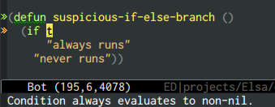

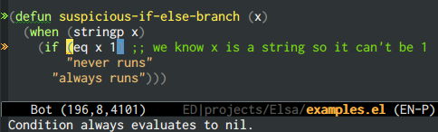

### Find unreachable code in short-circuiting forms

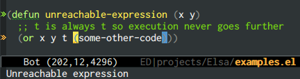

## Enforce style rules

### Provide helpful tips for making code cleaner

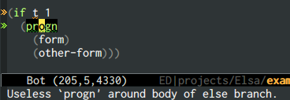

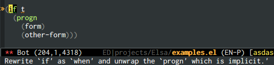

### Add custom rules for your own project with rulesets

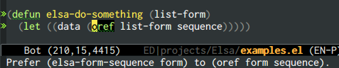

### Make formatting consistent


## Look for suspicious code

### Find references to free/unbound variables

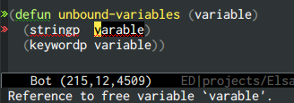

### Don't assign to free variables

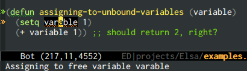

### Detect conditions which are always true or false


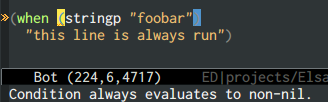

### Make sure functions are passed enough arguments

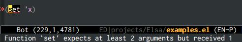

### Make sure functions are not passed too many arguments

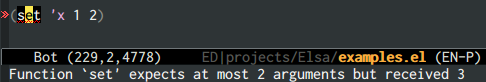

## Track types of expressions

### Check types of arguments passed to functions for compatibility

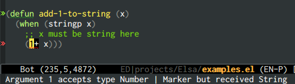

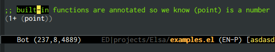

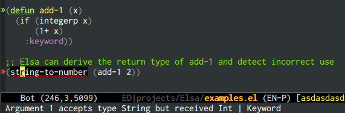

### Understand type narrowing from type guards and predicates

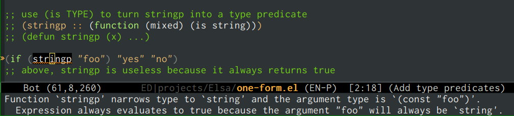


## Understand functional overloads

`downcase` can take a string and return a string or take an int and
return an int.  Because we pass a string variable `s`, we can
disambiguate which overload of the function must be used and we can
derive the return type of the function as `string` instead of `(or
string int)`.

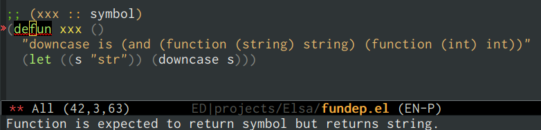

If we pass an input which doesn't match any overload, Elsa will show a
helpful report of what overloads are available and what argument
didn't match.

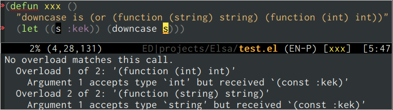

# How do I run it

Elsa can be run with [Eask][Eask], [Cask][Cask] or [makem.sh][makem].
Before you can perform analysis, see the
[Configuration](#configuration) section on how to configure the
project.

If you use Eask or Cask, you can use Flycheck and Flymake integrations
(see below).

In addition, Elsa also implements Language Server Protocol (LSP) and
can be used with [lsp-mode][lsp-mode].  This is the best option
because all the state is cached in the server and all the operations
are very fast.  LSP also exposes features of Elsa otherwise not
available, such as completion (via `lsp-completion-mode`) or
contextual hover type information.

The following table summarizes the options:

|--------------------------------|------|------|----------|
| Feature                        | Eask | Cask | makem.sh |
|--------------------------------|------|------|----------|
| Stand-alone analysis from CLI  | ✓    | ✓    | ✓        |
| Flycheck integration           | ✓    | ✓    | ⨯        |
| Flymake integration            | ✓    | ⨯    | ⨯        |
| Language Server Protocol (LSP) | ✓    | ✓    | ⨯        |
|--------------------------------|------|------|----------|

## Eask

### [RECOMMENDED] Using packaged version

This method uses [Eask][Eask] and installs Elsa from [MELPA][MELPA].

1. Add `(depends-on "elsa")` to `Eask` file of your project.
2. Run `eask install-deps`.
3. `eask exec elsa FILE-TO-ANALYSE [ANOTHER-FILE...]` to analyse the file.

### Using development version

To use the development version of Elsa, you can clone the repository
and use the `eask link` feature to use the code from the clone.

1. `git clone https://github.com/emacs-elsa/Elsa.git` somewhere to your computer.
2. Add `(depends-on "elsa")` to `Eask` file of your project.
3. Run `eask link add elsa <path-to-elsa-repo>`.
4. `eask exec elsa FILE-TO-ANALYSE [ANOTHER-FILE...]` to analyse the file.

## makem.sh

Using `makem.sh`, simply run this command from the project root
directory, which installs and runs Elsa in a temporary sandbox:

    ./makem.sh --sandbox lint-elsa

To use a non-temporary sandbox directory named `.sandbox` and avoid
installing Elsa on each run:

1.  Initialize the sandbox: `./makem.sh -s.sandbox --install-deps --install-linters`.
2.  Run Elsa: `./makem.sh -s.sandbox lint-elsa`.

See `makem.sh`'s documentation for more information.

## Cask

### [RECOMMENDED] Using packaged version

This method uses [Cask][Cask] and installs Elsa from [MELPA][MELPA].

1. Add `(depends-on "elsa")` to `Cask` file of your project.
2. Run `cask install`.
3. `cask exec elsa FILE-TO-ANALYSE [ANOTHER-FILE...]` to analyse the file.

### Using development version

To use the development version of Elsa, you can clone the repository
and use the `cask link` feature to use the code from the clone.

1. `git clone https://github.com/emacs-elsa/Elsa.git` somewhere to your computer.
2. Add `(depends-on "elsa")` to `Cask` file of your project.
3. Run `cask link elsa <path-to-elsa-repo>`.
4. `cask exec elsa FILE-TO-ANALYSE [ANOTHER-FILE...]` to analyse the file.

## Flycheck/Flymake integration

If you use [flycheck](https://github.com/flycheck/flycheck) you can
use the [flycheck-elsa](https://github.com/emacs-elsa/flycheck-elsa)
package which integrates Elsa with Flycheck.

For
[flymake](https://www.gnu.org/software/emacs/manual/html_node/emacs/Flymake.html),
you can use [flymake-elsa](https://github.com/flymake/flymake-elsa).

## Language server protocol (LSP)

Elsa's LSP implementation is currently work in progress, but the
server is stable enough that it is useful to have it on.  It makes the
linting very fast, because all the state is cached in the server
instance and we don't have to re-read the entire cache very time from
scratch (like when running through flycheck or flymake).

Elsa currently supports [lsp-mode][lsp-mode], but it is not yet
built-in to lsp-mode itself because it (Elsa LSP) is not stable
enough.  To use Elsa LSP, run `(elsa-lsp-register)` or `M-x
elsa-lsp-register`to register the client with `lsp-mode`.  After that,
using `M-x lsp` in an Elisp buffer will start a workspace.

Currently, these LSP capabilities are supported

|--------------------|------------------------------------------------------------------------------------------------------------------------------------------|
| Capability         | Implemented                                                                                                                              |
|--------------------|------------------------------------------------------------------------------------------------------------------------------------------|
| hoverProvider      | Provides contextual type annotations of forms under point                                                                                |
| textDocumentSync   | openClose, save                                                                                                                          |
| completionProvider | <ul><li>functions from workspace</li><li>variables from scope and workspace</li><li>special resolution of oref/oset slot names</li></ul> |
|--------------------|------------------------------------------------------------------------------------------------------------------------------------------|

# Configuration

For now Elsa supports very little configuration.  To "Elsa-enable"
your project, you have to add an `Elsafile.el` to the root of your
project.

Elsa has a concept of extensions and rulesets, which currently exist
mostly internally and are wrapped in one big "default" ruleset and
extension.  This system is still work in progress.

The following are some ways you can extend Elsa today.

## Analysis extension

One way to extend Elsa is by providing special analysis rules for more
forms and functions where we can exploit the knowledge of how the
function behaves to narrow the analysis down more.

For example, we can say that if the input of `not` is `t`, the return
value is always `nil`.  This encodes our domain knowledge in form of
an analysis rule.

All the rules are added in form of extensions.  Elsa has few core
extensions for most common built-in functions such as list
manipulation (`car`, `nth`...), predicates (`stringp`, `atomp`...),
logical functions (`not`, ...) and so on.  These are automatically
loaded because the functions are so common virtually every project is
going to use them.

Additional extensions are provided for popular external packages such
as [dash.el](https://github.com/magnars/dash.el).  To use them, add to
your `Elsafile.el` the `register-extensions` form, like so

``` emacs-lisp
(register-extensions
 dash
 ;; more extensions here
 )
```

Extensions are auto-loaded when Elsa comes upon a require form.  For a
`(require 'foo)` it will look for `elsa-extension-foo.el` and tries to
load it.  This means that in practice you will never have to register
extensions for most of the 3rd party packages.

## Rulesets

After analysis of the forms is done we have all the type information
and the AST ready to be further processed by various checks and rules.

These can be (non-exhaustive list):

* Stylistic, such as checking that a variable uses `lisp-case` for
  naming instead of `snake_case`.
* Syntactic, such as checking we are not wrapping the else branch of
  `if` with a useless `progn`.
* Semantic, such as checking that the condition of `if` does not
  always evaluate to `non-nil` (in which case the `if` form is
  useless).

Elsa provides some built-in rulesets and more can also be used by
loading extensions.

To register a ruleset, add the following form to `Elsafile.el`

``` emacs-lisp
(register-ruleset
 dead-code
 style
 ;; more rulesets here
 )
```

# Type annotations

In Elisp users are not required to provide type annotations to their
code.  While at many places the types can be inferred there are
places, especially in user-defined functions, where we can not guess
the correct type (we can only infer what we see during runtime).

Read the type annotations [documentation](./docs/type-annotations.org)
for more information on how to write your own types.

# How can I contribute to this project

Open an issue if you want to work on something (not necessarily listed
below in the roadmap) so we won't duplicate work.  Or just give us
feedback or helpful tips.

You can provide type definitions for built-in functions by extending
`elsa-typed-builtin.el`.  There is plenty to go.  Some of the types
necessary to express what we want might not exist or be supported yet,
open an issue so we can discuss how to model things.

# F.A.Q.

## What's up with the logo?

See the [discussion](https://github.com/emacs-elsa/Elsa/issues/80).

# For developers

After calling `(require 'elsa-font-lock)` there is a function
`elsa-setup-font-lock` which can be called from `emacs-lisp-mode-hook`
to set up some additional font-locking for Elsa types.

## How to write an extension for your-favourite-package

## How to write a ruleset

# Acknowledgments

The biggest inspiration has been the
[PHPStan](https://github.com/phpstan/phpstan) project, which provided
me the initial impetus to start this project.  I have went through
their sources many times finding inspiration and picking out features.

The second inspiration is
[TypeScript](https://www.typescriptlang.org/), which turned a rather
uninteresting language into a powerhouse of the (not only) web.

I borrow heavily from both of these projects and extend my gratitude
and admiration.

[Cask]: https://github.com/cask/cask
[Eask]: https://github.com/emacs-eask/cli
[makem]: https://github.com/alphapapa/makem.sh
[MELPA]: https://melpa.org
[lsp-mode]: https://emacs-lsp.github.io/lsp-mode/
